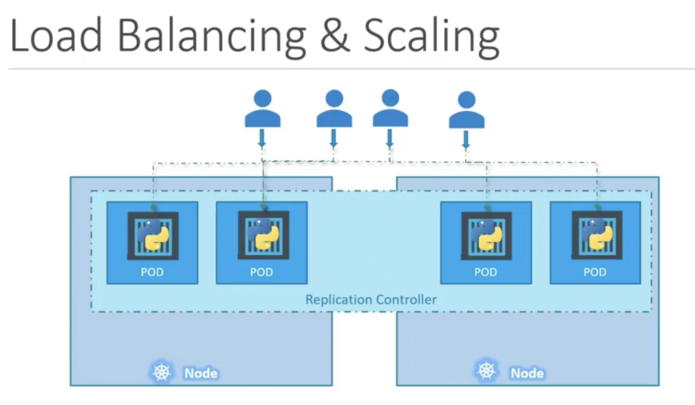

# Exame CKA

## Sumário

## Conceitos

## Kubernetes
Kubernetes (K8s) é um produto Open Source utilizado para automatizar a implantação, o dimensionamento e o gerenciamento de aplicativos em contêiner.

Ele agrupa contêineres que compõem uma aplicação em unidades lógicas para facilitar o gerenciamento e a descoberta de serviço. O Kubernetes se baseia em 15 anos de experiência na execução de containers em produção no Google, combinado com as melhores ideias e práticas da comunidade.

Concebido com base nos mesmos princípios que permitem ao Google executar milhares de contêineres por semana, o Kubernetes pode ser redimensionado sem aumentar sua equipe de operações.

Seja testando localmente ou executando uma empresa global, a flexibilidade do Kubernetes cresce com você para fornecer seus aplicativos de maneira consistente e fácil, independentemente de quão complexa seja sua necessidade

O Kubernetes é Open Source, o que te oferece a liberdade de utilizá-lo em seu próprio cluster local, em uma arquitetura híbrida ou em qualquer Provedor de Computação na Nuvem público, permitindo que você mova sem esforço suas aplicações para onde você quiser.

-----

## Nodes

São instâncias que armazenam contêiners, podem ser on-premisses ou cloud. Temos o exemplo do uso na PicPay do EKS onde utilizamos instâncias cloud para fazer o armazenamento dos contêiners.

- <strong>Worker Nodes:</strong> São nodes que servem para fazer o host das aplicações, ou seja, cada microserviço existente será "deployado" dentro de um worker node

- <strong>Control Plane Node/Master Node:</strong> Node responsável pelo gerenciamento do cluster K8s como um todo. Armazenando informações de nodes diferentes, fazendo o direcionamento de novos contêiners para os Worker Nodes e várias outras funções. Outra informação relevante é o fato de o Control Plane ser composto por vários componentes, que iremos citar abaixo.
----

## Control Plane Components

- <strong>ETCD:</strong> Armazenamento do tipo Chave-Valor consistente e em alta-disponibilidade usado como repositório de apoio do Kubernetes para todos os dados do cluster como, quais pods estão em quais nodes, em quanto tempo aconteceu o deploy e etc...

  Se o seu cluster Kubernetes usa etcd como seu armazenamento de apoio, certifique-se de ter um plano de back up para seus dados.

  Também é importante ressaltar que o ETCD armazena os dados dos Nodes, PODs, Configs, Secrets, Accounts, Roles, Bindigns e muitos outros.

  Todos os dados que vemos quando rodamos os comandos do kubectl, vem do ETCD.

  Quando montamos um setup com o kubeadm, o etcd-master é inicializado dentro da namespace kube-system.

- <strong>kube-scheduler:</strong> Componente da camada de gerenciamento que observa os pods recém-criados sem nenhum nó atribuído, e seleciona um nó para executá-los.

  Os fatores levados em consideração para as decisões de agendamento incluem: requisitos de recursos individuais e coletivos, hardware/software/política de restrições, especificações de afinidade e antiafinidade, localidade de dados, interferência entre cargas de trabalho, e prazos.

  Quando rodamos um ```kubectl run <podname> --image=<image>``` é feita uma request para o kube-apiserver e ele cria um pod sem associação a um node. O Scheduler constantemente monitora o apiserver e percebe que possui um pod sem node, ele identifica o node ideal para a criação do pod e retorna a informação ao apiserver. O apiserver atualiza a informação no ETCD e a repassa para o kubelet que faz o deploy no Worker Node e instrui o container runtime a fazer o deploy da aplicação. Uma vez que o processo de deploy for pronto o kubelet retorna a informação ao apiserver que atualiza a informação no ETCD.

  

  Também é importante ressaltar que o kube-scheduler filtra os nodes e basicamente faz a busca pelos quais não se enquadram no necessario para o pod, após esse passo, o scheduler ranqueia os nodes e coloca no que mais vai sobrar recurso.

    

  Entretanto, é válido entender que existem mais tópicos que precisamos ter conhecimento visando o scheduling de um pod como:
  - Resource Requirements and Limits
  - Taints and Tolerations
  - Node Selectore/Affinity
  - Entre outros


- <strong>Controller Manager</strong>
Componente da camada de gerenciamento que executa os processos de controlador.

  Logicamente, cada controlador está em um processo separado, mas para reduzir a complexidade, eles todos são compilados num único binário e executam em um processo único.

  Existem muitos tipos de controllers além dos citados abaixo, caso surja alguma dúvida verificar a documentação.

  Todos esses controllers se encontram dentro do Kube-Controller-Manager

    


- <strong>Node-Controller:</strong> Responsável por perceber e responder quando os nós caem. Também tem a responsabilidade de colocar novos Nodes dentro do cluster.

  O Node controller recebe informações do kube-apiserver a cada 5 segundos. Caso um node fique indisponível, existe um período de carência de 40 segundos para devidamente informar que o node está inacessivel. Assim que um node se tornar inacessivel, ele tem um tempo de 5 minutos para voltar a funcionar, caso não volte ele retira os pods do node falho e os distribui em um node saudavel. Os pods pertencentes a um deployment/replicset vão para o mesmo node.

    

- <strong>Replication-Controller:</strong> Responsável por garantir que o numero de containers desejados estejam disponíveis.

  Em um cenário onde temos um pod somente rodando (single pod) o Replication-Controller vai garantir que esse pod sempre esteja rodando, ou seja, caso o pod venha a ficar indisponível, ele cria um novo automaticamente.

  É importante ressaltar que o Replication-Controller vai atuar em multiplos Worker-Nodes, criando pods em nós diferentes.


    

- <strong>Job-Controller:</strong> Observa os objetos Job que representam tarefas únicas e, em seguida, cria pods para executar essas tarefas até a conclusão.

- <strong>Endpoint-Controller:</strong> Preenche o objeto Endpoints (ou seja, junta os Serviços e os pods).

- <strong>Token-Service-Account-Controller:</strong> Crie contas padrão e tokens de acesso de API para novos namespaces.

- <strong>kube-apiserver:</strong> O servidor de API é um componente da Camada de gerenciamento do Kubernetes que expõe a API do Kubernetes para operações. O servidor de API é o front end para a camada de gerenciamento do Kubernetes.

  A principal implementação de um servidor de API do Kubernetes é kube-apiserver. O kube-apiserver foi projetado para ser escalonado horizontalmente — ou seja, ele pode ser escalado com a implantação de mais instâncias. Você pode executar várias instâncias do kube-apiserver e balancear (balanceamento de carga, etc) o tráfego entre essas instâncias.

  É importante ressaltar que o kube-apiserver é responsável pelo escalonamento de todos os componentes de gerenciamento do Node Control-Plane.

  É também responsável pelo monitoramento e gerenciamento do estado do cluster e pela comunicação dos Worker-Nodes com o Node Control-Plane.

  Quando executamos um comando via kubectl, primeiramente é feito uma request para o kube-apiserver para fazer a autenticação e depois é consultado no ETCD do cluster e responde a request feita.

----

## Worker Node Components

- <strong>Kubelet:</strong> Um agente que é executado em cada Worker-Node no cluster. Ele garante que os contêineres estejam sendo executados em um Pod.

  O kubelet utiliza um conjunto de PodSpecs que são fornecidos por vários mecanismos e garante que os contêineres descritos nesses PodSpecs estejam funcionando corretamente. O kubelet não gerencia contêineres que não foram criados pelo Kubernetes.

  Também é responsável por enviar os dados dos containers e do Worker Node em que está presente de volta para o Node Control-Plane.

  É importante ressaltar que o kubelet recebe instruções do Node Control-Plane como as de: Criar novos pods, destruir pods existentes e etc...

- <strong>Kube-proxy:</strong> kube-proxy é um proxy de rede executado em cada Worker Node no seu cluster, implementando parte do conceito de serviço do Kubernetes.

  kube-proxy mantém regras de rede nos nós. Estas regras de rede permitem a comunicação de rede com seus pods a partir de sessões de rede dentro ou fora de seu cluster.

  kube-proxy usa a camada de filtragem de pacotes do sistema operacional se houver uma e estiver disponível. Caso contrário, o kube-proxy encaminha o tráfego ele mesmo.

  É importante entender que os pods conseguem o acesso normalmente com o ip de outros pods, porém, esse ip pode mudar caso o pod reinicie.
  
  Nesse Caso encontramos a necessidade de utilizar um service para o acesso entre pods, pois ele faz a referência ao pod, não ao ip.

  O Kube-proxy constantemente busca por services novos, assim que os encontra ele cria regras de acesso para o seu node.

- <strong>Container Runtime:</strong> O agente de execução (runtime) de contêiner é o software responsável por executar os contêineres.

  O Kubernetes suporta diversos agentes de execução de contêineres: Docker, containerd, CRI-O, e qualquer implementação do Kubernetes CRI (Container Runtime Interface).
---
## Pods

Um Pod define um "host lógico" específico para o aplicativo e pode conter diferentes contêineres que, na maioria dos casos, são fortemente acoplados. Por exemplo, um Pod pode incluir o contêiner com seu aplicativo Node.js, bem como um outro contêiner que alimenta os dados a serem publicados pelo servidor web Node.js. Os contêineres de um Pod compartilham um endereço IP e intervalo de portas; são sempre localizados, programados e executam em um contexto compartilhado no mesmo Nó.

Pods são a unidade atômica na plataforma Kubernetes. Quando criamos um Deployment no Kubernetes, esse Deployment cria Pods com contêineres dentro dele (em vez de você criar contêineres diretamente). Cada Pod está vinculado ao nó onde está programado (scheduled) e lá permanece até o encerramento (de acordo com a política de reinicialização) ou exclusão. Em caso de falha do nó, Pods idênticos são programados em outros nós disponíveis no cluster.


   


