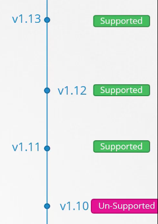
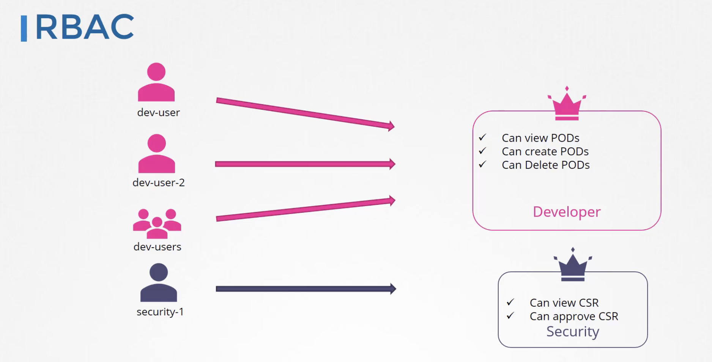

# Conceitos relacionados aos arquivos YAML

## Labels e Selectors

- <strong>Label:</strong> As Labels são do tipo chave/valor e são incluidas em objetos, como os pods. Labels são feitas para uso específico de identificação de atributos de objetos importantes e relevantrs para usuários, porém, nao afetam diretamente na semantica do funcionamento.

  Labels podem ser usadas para organizar e selecionar subsets de objetos e podem ser incluidas em componentes na sua criação e posteriormente adicionadas e modificadas em qualquer momento. Cada chave precisa ser única para o dado objeto.

- <strong>Selectors:</strong> Existem dois tipos de selectors, o equality-based e o set-based. Um Selector pode ser feito de muiltiplos requerimentos que são feitos em comma-separated. No caso de multiplos requerimentos, todos precisam estar em um padrão que satisfaça o comma-separated.

  Dentro do escopo do Selector, existe um campo chamado ``matchLabels`` que como o nome ja fala por si só, ele faz referência a uma lable já criada e dessa maneira o componente ja sabe qual pod vai monitorar.
---

## Services

- <strong>NodePort:</strong> Quando estruturamos o nosso arquivo YAML é necessário termos conhecimento de algumas informações.

   - *type:* O tipo do objeto de serviço a ser utilizado (NodePort, ClusterIP, LoadBalancer e ExternalName)

   - *ports:* Configuração de portas para o NodePort entrar em funcionamento

   - *targetPort:* Porta do pod

   - *targetPort:* Referência da porta do pod ao Service (NodePort)

   - *NodePort:* Porta a ser exposta para receber trafego. O range dessa porta precisa ser entre 30000 - 32767

  Como podemos perceber o campo ports é um array, logo, podemos ter mais de uma configuração.

  É importante ressaltar que o objeto de referência (POD, Deployment, ReplicaSet e etc...) tenha as labels definidas para conseguirmos fazer o attatch do serviço.
---

## Annotations

São parecidas com as lables, porém tem o uso designado para algo mais voltado a integração (buildVersion, ingress e etc).

## Taints e Tolerations

Taints são aplicados nos nodes, eles permitem que um node repudie um conjunto de pods.

Tolerations são aplicada em pods e permitem, mas não exigem que os pods sejam alocados em nós com taints correspondentes

Podemos imaginar um cenário, pode somente entrar na sala secreta quem possuir um cartão de acesso 3. Quem possuir um cartão de acesso 2, talvez consiga entrar, mas não é garantido e quem possuir um cartão de acesso 1, não vai conseguir entrar na sala. Os que ja estiverem dentro e possuirem um cartão de acesso 1, serão expulsos.

Nesse exemplo citado a sala secreta seria um Node, máquina de leitura de cartão seria a ``Taint`` e o nivel de acesso do cartão seria uma ``Toleration``.

Possuimos 3 tipos de taint:

- NoSchedule: O Kubernetes não alocará o pod naquele nó.
- PreferNoSchedule: O Kubernetes tentará não alocar o pod no nó.
- NoExecute: O pod será expulso do nó (caso já esteja em execução) e não será   alocado ao nó (caso ainda não esteja em execução).

Tratando-se em nível de POD, basicamente quando criamos uma toleration, devemos pensar ao contrário, como se fosse uma imunização, ou seja, se o node possuir uma Taint de ``NoSchedule`` e o POD uma Toleration de ``NoSchedule``, logo, esse pod poderá ser alocado dentro do node com a Taint.

Podemos ter vários tipos de taint no mesmo nó e é interessante prestarmos atenção ao executarmos a tarefa.

Outro exemplo muito interessante é o node ControlPlane. Podemos nos perguntar, porque o scheduler não cria nenhum POD dentro do ControlPlane? A resposta é: Pois quando a criação do cluster acontece, é aplicado um ``Taint`` no node e não conseguimos subir nenhum outro pod/deployment/service/etc... dentro do mesmo.

## Node Selectors

O Node Selector é a recomendação mais simples de seleção de nodes para a criação de pods. Você consegue adicionar o campo ``nodeSelector`` no YAML do seu POD e referenciar esse valor nas lables do node que você deseja utilizar como alvo para a criação do POD. O Kubernetes somente faz schedule do POD nos nodes que tiverem cada uma das lables especificadas.

Como vários objetos do Kubernetes, os nodes também possuem labels! Você pode criar labels manualmente. O K8s também popula um set padrão de labels em todos os nodes em um cluster.

## Node Affinity
Node Affinity é conceitualmente similar ao nodeSelector, permitiondo você restringir quais nodes o seu POD pode ter um schedule baseado nas Node labels.
Existem 2 tipos de afinidade:

- *requiredDuringSchedulingIgnoredDuringExecution:* O Scheduler não consegue fazer schedule do POD a menos que a regra conicida. Essa função é bem parecida com o nodeSelector, porém, tem uma complexidade um pouco mais expressiva.

- *preferredDuringSchedulingIgnoredDuringExecution:* O Scheduler tenta encontrar um node que conicida com as regras especificadas. Se um node coincidente for encontrado e ele não estiver disponível, o scheduler mesmo assim faz o schedule do POD.

É importante cidtar o uso dos operadores lógicos disponíveis. Aqui estão eles:

``In``, ``NotIn``, ``Exists``, ``DoesNotExist``, ``Gt`` e ``Lt``

O ``NotIn`` e ``DoesNotExist`` servem para o fazer o anti-affinity. Essa funcionalidade é muito parecida com o ``Taint``, que foi mencionado no tópico anterior.

- *In:* Quando nosso nodeAffinity estiver configurado com o operador In, o Scheduler irá buscar por varios nodes, não somente um, ex:

podemos ter:

```yaml
  affinity:
    nodeAffinity:
      requiredDuringSchedulingIgnoredDuringExecution:
        nodeSelectorTerms:
        - matchExpressions:
          - key: size
            operator: In
            values:
            - Large
```

e também podemos ter:

```yaml
  affinity:
    nodeAffinity:
      requiredDuringSchedulingIgnoredDuringExecution:
        nodeSelectorTerms:
        - matchExpressions:
          - key: size
            operator: In
            values:
            - Large
            - Medium
```

Podemos comparar com o operador lógico OU. Se o Scheduler encontrar um node com a label size e o valor Large ou Medium, ele irá alocar o POD no NODE mais condizente com a situação, sem se preocupar com o valor da label.

- *Exists:* Busca somente pelo valor da label e não pelo valor, se o node possuir uma label condizente o Scheduler irá prosseguir com o Schedule.

```yaml
    affinity:
    nodeAffinity:
      requiredDuringSchedulingIgnoredDuringExecution:
        nodeSelectorTerms:
        - matchExpressions:
          - key: size
            operator: Exists
```

## DaemonSet

Um DaemonSet garante que todos os Nodes (Ou alguns) rodem uma copia dos pods.

Casos de uso para os DaemonSets

- Quando queremos ter algum tipo de monitoramento fixo dentro do nosso node sem que ele se renove a cada deploy

- Quando queremos ter algum tipo de captura de log fixo dentro do nosso node

- O componente Kube-proxy pode ser deployado como um daemonset

## Static Pod

São gerenciados diretamente pelo kubelet em um node específico, sem o API Server. Diferente dos pods que são gerenciados pelo Control Plane o kubelet cuida de cada POD dentro do node e caso eles falhem ele os restarta.

O Kubelet automaticamente tenta criar um mirror Pod no Api Server para cada POD Estatico. Isso significa que os pods rodam em um node onde o API Server consegue enxerga-los, porém não podem ser controlados.

É importante mencionar que os arquivos YAML devem ser criados dentro de ``/etc/kubernetes/manifests`` que é onde o kubelet ira buscar pelos arquivos de especificação.

- Podemos utilizar os PODS estáticos para criarmos um Control Plane dentro de um Node. Em um cenário onde ja possuímos algum cluster pré-configurado, podemos em um futuro, necessitar de mais de um Control Plane então podemos criar um Node novo e dentro dele, gerar vários manifestos com os componentes do kubernetes dentro do diretório citado acima. Desta maneira não precisamos configurar um Node Control Plane do 0.

- Os pods estaticos tem a nomenclatura do tipo
  ``nomedopod``-``nomedonode``

- Outro ponto de extrema importância é sempre olhar qual é o caminho de configuração dentro do kubelet para os manifestos YAML. Para conseguirmos ver essa conf  basta executar um cat neste caminho ``/var/lib/kubelet/config.yaml``

## Metrics Server

Por padrão o k8s não vem com nenhuma configuração de analise de métricas. Temos a necessidade de instalar

```
minikube addons enable metrics-server
```

```
git clone https://github.com/kodekloudhub/kubernetes-metrics-server.git
```

```
kubectl create -f deploy/1.8+/
```

## Roling Update

Usuários tem a expectativa da aplicação sempre estar no ar sem nenhum tipo de downtime e desenvolvedores também tem a expectativa de lançar novas versões muitas vezes ao dia. No Kubernetes isso é feito com os rolling updates. Rolling Updates permitem que os Deployments atualizem seus pods sem nenhum tipo de downtime atualizando incrementalmente instâncias de pods com novas. Os PODS vão sofrer o scheduling em Nodes com recirsos disponíveis.


## ConfigMaps

Um ConfigMap é um objeto da API usado para armazenar dados não-confidenciais em pares chave-valor. Pods podem consumir ConfigMaps como variáveis de ambiente, argumentos de linha de comando ou como arquivos de configuração em um volume.

Um ConfigMap ajuda a desacoplar configurações vinculadas ao ambiente das imagens de contêiner, de modo a tornar aplicações mais facilmente portáveis.

## Secrets

São objetos com o mesmo segmento do ConfigMap porém visando a encriptação de dados que não podem ser expostos públicamente.

Dentro do container é criado um arquivo no caminho:
``/opt/app-secret-volumes/<nomedosecret>``

## Cluster Maintenance

Caso um node sofra um downtime, os pods ficarão indisponíveis. Se um node voltar a vida imediatamente, o kubernetes volta a fazer o processamento imediatamente, entretanto, se o node morrer por mais de 5 minutos, os pods são exterminados desse node, se os pods forem parte de uma replicaset, eles são criados dentro de outros nodes.

É importante ressaltar que para garantirmos que isso não aconteça, devemos criar deployments para que nesses tipos de cenário os pods do replicaSet sejam recriados em algum outro node.

O ``pod-eviction-timeout`` é responsável por definir o tempo máximo de espera para um node que esta indisponível, ou seja, caso o tempo definido seja 10 minutos, o node control-plane vai esperar 10 minutos para considerar o Worker Node morto.

Para configurarmos o eviction timeout é necessário informar ao controller manager a configuração

```
kube-controller-manager --pod-eviction-timeout=5m0s
```


Quando o node indisponível volta a ser disponível, ele sobe sem nenhum pod dentro dele, pois os pods que antes estavam dentro dele foram criados em outro Worker Node.

É importante ressaltar que os pods que não são fazem parte de nenhum replicaset não serão recriados em nenhum dos nodes, ou seja, eles morreram e não vão mais voltar a vida. Será necessário fazer o redeploy dos mesmos.

Para garantir que os seus workloads remanescentes continuem disponíveis durante uma manutenção, você pode configurar o PodDisruptionBudget.

É importante ressaltar que num cenário de manutenção nenhum dos controllers pode estar em versões acima do kube-apiserver. O Controller-manager e o kube-scheduler podem somente estar uma versão a menos que o kube-apiserver, o kubelet e kube-proxy podem somente estar duas versões abaixo do kube-apiserver.

O kubectl pode estar 1 versão acima ou uma versão abaixo do kube-apiserver.

O Kubernets dá suporte somente para as ultimas 3 versões, veja a foto abaixo para ter um entendimento melhor:



Pelos padrões de update não é aconselhavel fazer a atualização da versão v1.10 para a v1.13. É recomendado o update por versões, ou seja, v1.10 -> v1.11 -> v1.12 -> v1.13.

Caso você esteja fazendo o update em um Cloud Provider como a GCP, AWS ou AZURE, você tem maneiras mais faceis de fazer o upgrade. Caso tenha provisonado o seu cluster, você pode utilizar o kubeadm  para fazer a atualização. Se você criou o seu k8s do 0 você o update é feito de componente para componente.

### Kubeadm

Quando entramos em um cenário de update, é importante começar pelo control-plane. O Node Control-Plane, vai ficar indisponível por algum tempo, porém isso não significa que os Nodes Workers não vão ficar indisponíveis. Como o control-plane estará inativo, não poderemos de maneira alguma acessar o control-plane ou os seus componentes, ou seja, não conseguiremos fazer deploys, remover deployments ou executar qualquer tipo de tarefa. Para caso mais extremos, caso um pod venha a falhar, esse pod não sofrerá um reschedule.

Assim que a atualização se completar, o nosso control-plane voltará para o funcionamento com os seus componentes atualizados para a nova versão.

Existem várias estrategias para o update dos worker nodes, a primeira delas é fazer o update de todos os worker nodes, porém, teremos um downtime durante a manutenção, o que é uma desvantagem significativa para a experiência do usuário. Assim que a o update completar, os pods vão ser alocados nos nodes normalmente.

A outra estrategia, é fazer o upgrade graduativamente, ou seja, node por node ou grupos de nodes caso o tamanho do cluster seja grande. Primeiramente fazemos o upgrade do primeiro node, fazendo assim que os nossos workloads sejam transferidos para outros nodes. Assim que o node em manutenção terminar de atualizar, partimos para o segundo node e os workloads são transferidos para os outros nodes disponíveis e assim sucessivamente.

A terceira estratégia é criar novos nodes em versões novas e decomissionando os nodes com versões antigas. Primeiramente é necessária a criação dos novos nodes e após essa tarefa, precisamos mover os workloads para esse novo node.

Quando fazemos o update de um node, não veremos imediatamente a alteração na versao quando rodarmos o ``kubectl get nodes``, pois é listado a versão do kubelet. Para conseguimos enxergar esse update, é necessário fazer a atualização do kubelet.


 ## Disruptions 
 cons
 Pods não desaparecem a menos que (uma pessoa ou um controller) destrua-os, ou exista algum tipo inevitavel de problema de hardware ou algum erro de softwara.

  Chamamos esses casos de *involuntary disruptions* em uma aplicação.
  Citamos alguns exemplos abaixo:
  - Alguma falha de hardware na maquina física fazendo o node ficar indisponível
  - Remoção da instância pelo administrador do cluster
  - Falha no Cloud Provider ou no Hypervisor fazendo a instância desaparecer
  - Alguma pane no kernel
  - Node desaparecendo do cluster devido a alguma partição de rede
  - Despejo de um pod devido ao node ficar sem recursos de memória ou cpu.

  Em excessão ao caso que o node fica sem recursos, a maioria dessas situações devem ser familiares para grande parte dos usuarios; Não são tão específicos no Kubernetes.

  Chamamos os outros casos de *voluntary disruptions*. Esses casos incluem ambas as ações iniciadas pelos donos da aplicação em sí e pelos mantenedoers do Cluster.

  Ações típicas de um dono de uma aplicação:
  - deletar o deployment ou algum controller que gerencie o pod
  - update do template do pod causando um restart
  - deletar um pod diretamente (intencionalmente ou acidentalmente)

  Ações tipicas de um administrador de cluster:
  - Drain de um node para fins de manutenção
  - Drain de um node para escalar um cluster pra baixo e diminuir o seu tamanho
  - Remover um pod de um node para permitie que alguem crie um deployment, replicaset ou ate1 mesmo um pod no lugar do que foi removido.

  Essas ações podem ser diretamente tomadas pelo administrador do cluster, ou algima automação rodada pelo administrador do cluster, ou também pelo Cloud Provider

  <strong>Cuidado:</strong> Nem todas as *voluntary disruptions* são restringidas pelo Pod Disruption Budget. Por exemplo, deletar um deployment ou pod, faz o bypass do Pod Disruption Budget.

  ### Lidando com disruptions

  Aqui temos algumas maneiras de mitigar *involuntary disruptions*:

  - Garantir que as requests do seu pod vai ter os recursos necessários.
  - Replicação de apicação caso você necessite uma disponibilidade mais alta.
  - Para uma disponibilidade ainda mais alta, espalhe aplicações ao longo de racks ou zonas.

  A frequencia de *voluntary disruptions* varia. Em um pequeno cluster não existem automações para *voluntary disruptions* (somente disparadas por usuarios).

  De qualquer maneira, o seu administrador do cluster ou provider talvez rode alguns serviços adicionais que causarão várias *voluntary disruptions*. Tambe1m algumas implementações de autoscaling do cluster (node) podem causar algum tipo de *voluntary disruptions*. Por exemplo, fazer o rollout de updates de software de nodes pode causar uma *voluntary disruptions* para a defragmentação de um node compacto. É importante ter documentado todos os tipos de *disruptions*. Algumas opções de configuração como PriorityClasses na especificação do seu pod, podem causar disrupções voluntarias e invlountarias.


## Pod disruption budget

O Kubernetes oferece features para rodar aplicações de alta disponibilidade mesmo quando introduzido fequentes *voluntary disruptions*.

Como um dono de aplicação, voce2 pode criar o PodDisruptionBudget para cada aplicação. O PDB limita o numero de pods de uma aplicação replicada que está indisponivel simultaniamente de *disrupções voluntarias*. Por exemplo, uma aplicação baseada em quorum, o PDB garante que o numero de replicas rodando numca vai ser abaixo de um numero. Um front end web talvez precise garantir que um numero de replicas não fique abaixo de uma certa porcentagem.

Por exemplo, o ``kubectl drain`` permite que você marque um node que vai sair de serviço. QUando você roda o comando, a ferramenta tenta despejar todos os pods no Node que voce2 esta tirando de serviço. A requisição de despejo que é submetida, talvez seja temporariamente rejeitada, enta2o a ferramenta periodicamente faz novas tentativas para todas as requests que falharam ate1 que todos os Pods do node alvo sejam destruidas, ou até que o timeout configurado seja alcançado.

## Backup - Resource Configs

Existem várias maneiras de se criar objetos dentro do k8s, de maneira imperativa e declarativa, é importante sempre ter em mente que precisamos manter os arquivos em algum tipo de armazenamento de código como o GitHub, para caso o cluster venha a ficar indisponível tenhamos esses objetos armazenados de maneira adequada para fazer a recriação dos mesmos.

Existem tecnologias que ajudam a fazer o backup do seu cluster como a VELERO. Essa ferramenta faz todo o backup dos objetos dentro do seu cluster Kubernetes.

### ETCD

ETCD é uma fonte de armazenamento altamente disponível e consistente que se baseia no formato de chave e valor para todos os dados do cluster, ou seja, cada objeto que criarmos, o ETCD será responsável por armazenar as especificações dos mesmos.

Se o seu cluster se utiliza do ETCD como maneira de armazenamento, certifique-se de que você tem alguma estratégia de backup para esses dados.\

Como podemos perceber o ETCD é hosteado dentro dos Control Plane nodes e ele possui um caminho de configuração na hora de sua criação onde todos os dados de criação dos objetos serão armazenados.

Segue abaixo a configuração:
 
``--data-dir=/var/lib/etcd``

É importante ressaltar que o ETCD possui uma ferramenta de snapshots onde podemos salvar constantes "estados" do ETCD.

## Segurança

Todos os clusters de kubernetes tem duas categorias de usuarios: *Service Accounts*, gerenciadas pelo K8s e usuários normais.

Podemos assumir que um serviço de cluster independente gerencia os usuários na seguinte maneira:

 - Um adiministrador distribuindo chaves privadas
 - Um usuário armazenado dentro de alguma cloud
 - Uma lista de usuários e senhas dentro de um arquivo

Neste caso, o kubernetes não possui nenhum objeto que represente usuarios normais e contas. Usuários normais nao podem ser adicionados em um cluster por uma chamada API.

De uma maneira geral, um usuário normal não pode ser adicionado por uma chamada API, os usuários que possuirem um certificado válido assinado pelo CA, são considerados autenticados. Nessa configuração o Kubernetes determina o username.

Tudo isso pode ser gerenciado pelo Role Based Access Control(RBAC) *sub-sytem* que determinará as ações que um determinado usuário poderá tomar.

Todos os usuários são gerenciados pelo kube-apiserver, independentemente se estamos fazendo uma request via CURL ou buscando informações pelo kubectl.

Existem várias maneiras de se autenticar dentro do kube-apiserver, citarei algumas abaixo:

- Arquivo com a listagem de senhas estáticas (Não recomendado)
  - Para fazer a criação de usuários nesse formato, precisamos ter um arquivo CSV contendo a senha, username e userId. É necessário fazer a configuração do kube-apiserver para o funcionamento desse tipo de autenticação. É necessário informar o ``--basic-auth-file=<csv-file>.csv`` dentro da configuração do service ``kube-apiserver.service``. Para as alterações fazerem efeito, é necessário reiniciar o kube-apiserver.
  - Caso você tenha criado o seu cluster via Kubeadm, é necessário modificar o manifesto gerado pelo próprio Kubeadm.
  - Para autenticar, é necessário informar o usuário na requisição dessa maneira:
    ```
    curl -v -k https://master-node-ip:6443/api/v1/pods -u "user:password"
    ```
  - No arquivo de usuários mencionado previamente, podemos ter uma coluna adicional especificando o grupo de cada usuário.

  - Quando criamos o cluster com o Kubeadm, é necessário criar volumes para os arquivos

- Arquivo com a listagem de tokens (Não recomendado)
  - A autenticação com tokens funciona da mesma maneira que com usuários, a diferença é que em vez de utilizarmos a senha no arquivo csv, colocamos o token, e os campos de usuario, userId e grupo, permanecem os mesmos.
  - Para a configuração da funcionalidade, precisamos informar o arquivo no campo token-auth-file. ``--token-auth-file=<csv-file>.csv``.
  - Para autenticar, é necessário informar o token por meio de um header de autorização dessa maneira:
  ```
  curl -v -k https://master-node-ip:6443/api/v1/pods --header "Authorization: Bearer <TOKEN>"
  ```
  - Quando criamos o cluster com o Kubeadm, é necessário criar volumes para os arquivos

- Certificados
  - Precisamos gerar chaves publicas e privadas para todos os componentes do control plane e workers, para que eles consigam se comunicar com o kube-apiserver do k8s. Também é necessario criar o CA para fazer a assinatura desses certificados, geralmente existem 2 CA's para o cluster, um para o ETCD e outro para os demais, já que é somente o kube-apiserver tem acesso.

  - Primeiramente geramos uma chave privada, podemos utilizar esse comando (Private key)
    ```
    openssl genrsa -out ca.key 2048
    ```
  - Com a chave privada podemos criar uma requisição de assinatura para a chave criada previamente. (Public Key)
    ```
    openssl req -new -key ca.key -subj "/CN=KUBERNETES-CA" -out ca.csr
    ```
  - Para gerar a assinatura especificamos a requisição de assinatura previamente gerada. (CA)
    ```
    openssl x509 -req -in ca.csr -signkey ca.key -out ca.crt
    ```

- Certificados de usuários administradores e não administradores
  - Primeiramente geramos a chave privada
  ```
  openssl genrsa -out admin.key 2048
  ```
  - Depois geramos a chave pública e fazemos a requisição de assinatura
  ```
  openssl req -new -key admin.key -subj "/CN=kube-admin" -out admin.csr
  ```
  - E finalmente geramos a assinatura do certificado
  ```
  openssl x509 -req -in admin.csr -CA ca.crt -CAkey ca.key -out admin.crt
  ```

  - Para definirmos os grupos de usuários, podemos declarar dentro da requisição de assinatura uma especificação dentro da flag -subj

  ```
  openssl req -new -key admin.key -subj "/CN=kube-admin/O=system:masters" -out admin.csr
  ```

  - Nos casos de componentes precisamos incluir um prefixo na hora da requisição do CA, podemos tomar como exemplo o ``kube-scheduler``

  ```
  openssl req -new -key kube-scheduler.key -subj "/CN=system:kube-scheduler" -out kube-scheduler.csr
  ```

  - Para a utilização de certificados como usuário, podemos fazer uma request dessa maneira:
  ```
  curl http://kube-apiserver:6443/api/v1/pods \ --key admin.key --cert admin.crt --cacert ca.crt
  ```

## Autorização

Na inicialização do cluster, podemos é setado alguns tipos de modos de autorização, porém existem diversos outras maneiras de fazermos o gerenciamento de permissões.

Para alterarmos essa configuração, precisamos acessar o manifesto do kube-api e alterar a flag ``--authorization-mode=``

É importante ressaltar que dentro da flag ``--authorization-mode=`` podemos ter algumas maneiras de autenticação igual a esse exemplo:

``--authorization-mode=Node,RBAC,Webhook``

Caso o Node rejeite a requisição ela será encaminhada para o RBAC e se for recusada passará para o Webhook e assim sussetivamente.


## RBAC

*Role-based Access Control* é um metodo de regulação de acesso para recursos computacionais ou de rede baseado em *roles* para usuários individuais dentro de uma organização.

O RBAC utiliza o ``rbac.authorization.k8s.io`` API Group para dirigir a autorização, permitindo você a configurar dinamicamente politicas ao longo da API do Kubernets.

